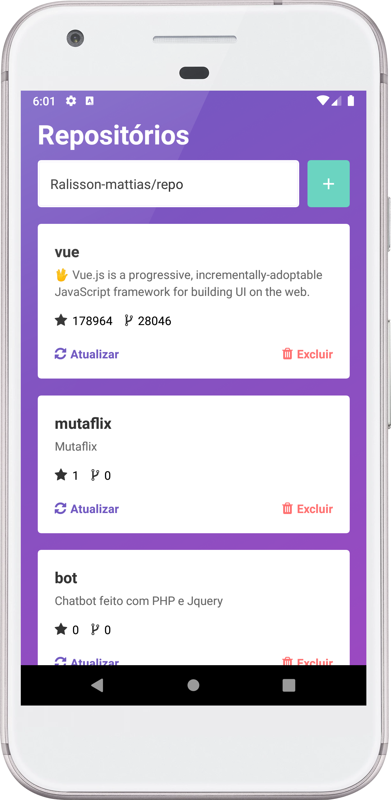
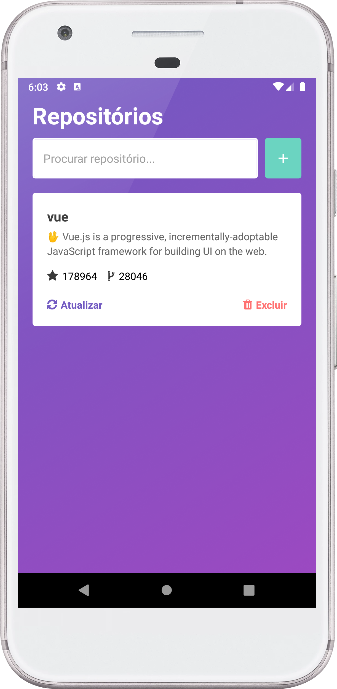

# Projeto desenvolvido com react-native e RealmDB
> O projeto consiste em buscar os repositórios git e adicionar localmente no seu dispotivo móvel, através da api do github

  
  

# Instalação
* No seu terminal, utilize o comando: `git clone https://github.com/Ralisson-Mattias/realmDB`
* Após copiar o projeto para a sua maquina, utilize os comandos `npm install` ou `yarn install` para instalar as dependências necessárias

## Como usar
> O app tem somente uma tela,onde são executadas todas as ações  
> Para buscar um projeto, basta buscar pelo nome de usuario e o nome do repositório. Ex: `Ralisson-mattias/realmDB`  
> Repositórios inexistente ou com digitação incorreta, não serão validados
> O botão de atualização serve pra detectar mudanças nos números de forks ou stars

#### Links
* https://realm.io/
* https://reactnative.dev/
